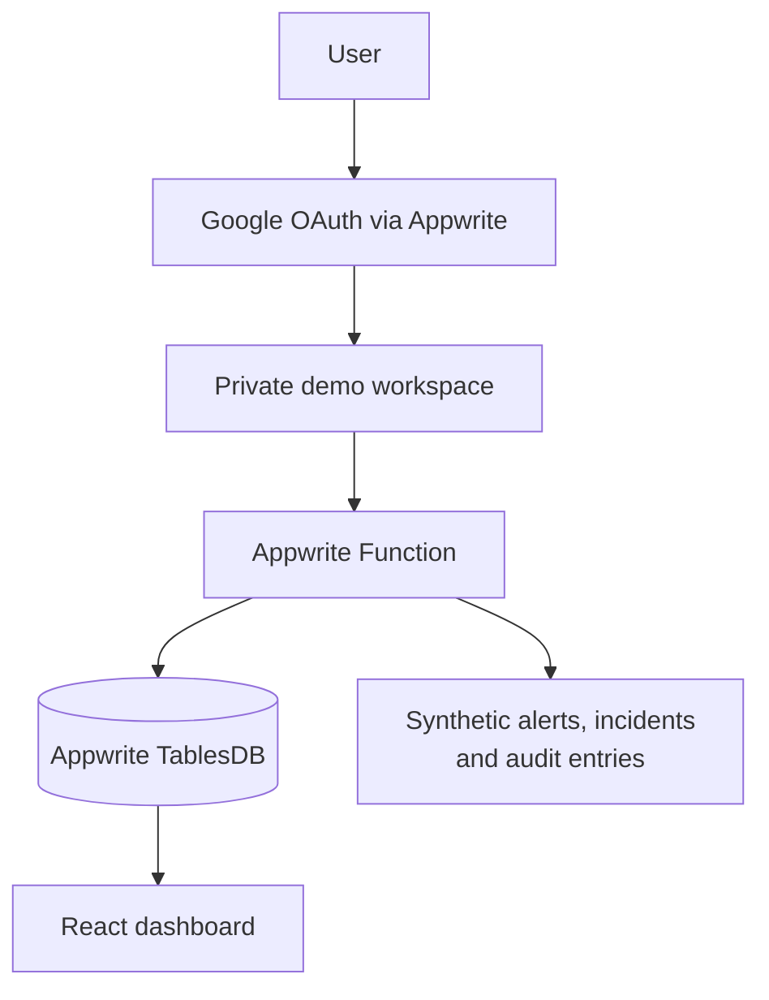

# Sentinel Lab — SOC Demo Dashboard

[](https://appwrite.io/)
[](https://react.dev/)
[](#demo-mode-and-safety)

**Sentinel Lab** adalah dashboard SOC multi-user untuk demonstrasi dan pembelajaran. Setiap pengguna yang masuk melalui Google OAuth memperoleh workspace Appwrite privat dengan alert, incident, notifikasi, audit log, dan grafik yang seluruhnya dibuat dari data sintetis.

**Live demo:** [soc.hajijinamri.me](https://soc.hajijinamri.me/)

> Dashboard ini bukan SIEM produksi dan tidak terhubung ke Wazuh, Zabbix, Telegram, MongoDB, ataupun log asli selama mode demo aktif.

## Highlights

- Login Google OAuth melalui Appwrite.
- Workspace dan data sintetis terisolasi untuk setiap pengguna.
- Alert, incident workflow, catatan investigasi, notifikasi simulasi, dan audit log.
- Grafik tren alert, severity distribution, dan incident workflow menggunakan Recharts.
- Appwrite Function untuk provisioning, pembuatan alert sintetis, perubahan status incident, catatan, dan reset workspace.
- Deploy frontend melalui Appwrite Sites.
- Adapter Wazuh dan Zabbix yang **integration-ready**, tetapi terkunci di mode demo.
- Dokumentasi rencana integrasi Telegram tanpa menyimpan token di browser.

## Demo mode and safety

Nilai berikut harus dipertahankan untuk lingkungan publik/demo:

```text
DEMO_MODE=true
LIVE_INTEGRATIONS_ENABLED=false
```

Dalam kondisi tersebut:

- tidak ada API Wazuh atau Zabbix yang dipanggil;
- tidak ada pesan yang dikirim ke Telegram;
- token, API key, URL internal, dan kredensial tidak pernah dimasukkan ke variabel `VITE_*`;
- semua data dashboard adalah data latihan, termasuk alamat IP dokumentasi;
- row permission Appwrite membatasi akses data kepada pemilik workspace.

## Architecture



## Features

| Area | Capability |
|---|---|
| Overview | Metrics, recent alerts, and data-driven charts |
| Alerts | Search, filter, detail view, and synthetic-alert generator |
| Incidents | Kanban workflow, status update, detail view, and notes |
| Notifications | In-browser Telegram-style simulation and production guide |
| Audit log | Per-workspace trace of demo actions |
| Integrations | Disabled Wazuh/Zabbix readiness status and activation checklist |
| Settings | Account information and safe workspace reset |

## Tech stack

- React + TypeScript + Vite
- Appwrite Auth, TablesDB, Storage, Functions, and Sites
- Recharts
- Google OAuth

## Local setup

### 1. Install dependencies

```bash
npm install
```

### 2. Configure environment

Create `.env` from `.env.example`. Fill in the Appwrite endpoint, project ID, table IDs, function ID, and server-only setup credentials.

Do not commit `.env`. Never put an API key, OAuth secret, Telegram token, Wazuh token, or Zabbix token in a `VITE_*` variable.

### 3. Create or verify the Appwrite schema

```bash
npm run setup:appwrite
npm run verify:appwrite
```

### 4. Deploy the demo workspace Function

```bash
npm run deploy:provision
```

The Function must be executable by authenticated users only. Its dynamic API key requires `rows.read` and `rows.write`.

### 5. Run locally

```bash
npm run dev
```

## Appwrite Sites deployment

Connect this repository to Appwrite Sites and use:

```text
Install command: npm install
Build command: npm run build
Output directory: ./dist
Fallback file: index.html
```

Configure the client-safe `VITE_APPWRITE_*` variables inside the Site settings. Do not configure `APPWRITE_API_KEY` in Appwrite Sites.

For Google OAuth, register the final Site hostname as an Appwrite Web platform.

## Production integration readiness

This repository includes disabled adapter code for Wazuh and Zabbix. It is not a production connector by default.

Read these documents before enabling any live integration:

- [Wazuh + Zabbix integration-ready design](docs/INTEGRATION-READY.md)
- [Telegram integration reference](docs/TELEGRAM-INTEGRATION.md)

Production integration must use a separate environment, scheduled server-side Functions, secret variables, read-only provider accounts, filtering/redaction, idempotency, and explicit approval.

## Scripts

| Command | Purpose |
|---|---|
| `npm run dev` | Start the local Vite server |
| `npm run build` | Type-check and build the frontend |
| `npm run setup:appwrite` | Create/complete the demo schema and bucket |
| `npm run verify:appwrite` | Verify access to the Appwrite schema |
| `npm run deploy:provision` | Deploy the Appwrite demo Function |

## License

This project is intended for portfolio, learning, and safe demo use. Review security, privacy, licensing, and operational requirements before adapting it for production.
