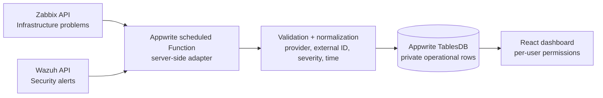

# Wazuh + Zabbix integration-ready design

## Current safety state

This project is deliberately in **synthetic demo mode**:

- `DEMO_MODE=true`
- `LIVE_INTEGRATIONS_ENABLED=false`
- no Wazuh or Zabbix URL is called;
- no real log, host name, IP address, token, or credential is shown in the browser;
- all dashboard rows remain private to the authenticated Appwrite user.

The code in `functions/provision-workspace/src/integration-adapters.js` is a disabled adapter layer. It normalizes provider payloads only after a future production approval enables it.

## Target production architecture



The browser never calls either provider directly. The scheduled Function is the only integration boundary.

## Provider responsibilities

| Provider | Import only | Dashboard use |
|---|---|---|
| Wazuh | alerts, rule level, timestamp, source context | security alert and incident workflow |
| Zabbix | problems, severity, event time, host/service context | infrastructure-health panel and correlated incident context |

## Normalized event contract

Every imported provider record must become this server-side shape before storage:

```ts
type NormalizedEvent = {
  provider: 'wazuh' | 'zabbix';
  externalId: string;
  title: string;
  severity: 'low' | 'medium' | 'high' | 'critical';
  sourceIp: string;
  occurredAt: string; // ISO 8601
  raw: unknown;       // never render raw data without review
};
```

Use an idempotency key of `provider:externalId`; do not create a duplicate alert each time the scheduled import runs.

## Production activation checklist

Do not follow this checklist for the public demo site. It is only for a separately approved production environment.

1. Create a new Appwrite project or database for production; do not reuse demo rows.
2. Create a **dedicated scheduled Appwrite Function** with no browser execution permission.
3. Give the Function only the minimum TableDB scopes it needs.
4. Add these values as **secret Function variables**, never as `VITE_*` variables or repository files:

   ```text
   WAZUH_API_URL
   WAZUH_API_TOKEN
   ZABBIX_API_URL
   ZABBIX_API_TOKEN
   ```

5. Require HTTPS, restrict outbound access to approved API hosts, and use provider accounts that are read-only.
6. Set `DEMO_MODE=false` and `LIVE_INTEGRATIONS_ENABLED=true` only in that scheduled Function.
7. Start with a small, read-only sample and verify normalization, severity mapping, duplicate handling, permissions, retention, and redaction.
8. Add monitoring for import failures without placing provider credentials or raw sensitive payloads in the audit log.

## Data minimization and redaction

- Do not store raw Wazuh logs by default.
- Redact usernames, internal addresses, command lines, tokens, and file contents before persistence.
- Keep only the fields needed for triage.
- Use short retention for imported operational data and document who may access it.

## Rollback

Set `LIVE_INTEGRATIONS_ENABLED=false`, disable the scheduled Function, revoke provider tokens, and verify no new provider records enter Appwrite. The synthetic demo dashboard continues to work independently.
