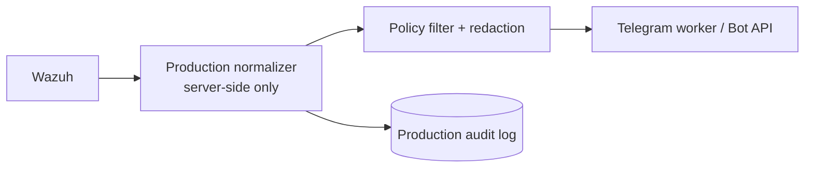

# Telegram integration reference

## Demo boundary

The SOC demo dashboard does **not** integrate with Telegram. Its notifications are synthetic, displayed only in the browser, and must remain that way for the public/demo environment.

The related reference project is [amri134/wazuh-on-telegram](https://github.com/amri134/wazuh-on-telegram). It is a separate operational bot that uses Wazuh, Telegram Bot API, MongoDB, Playwright, Gemini, and a Heroku worker. Do not merge its credentials, database, or Wazuh connection into this Appwrite demo project.

## Approved production pattern



The web dashboard is intentionally outside this path. It may show a copy of a normalized notification record, but it must never hold the Telegram bot token.

## Before activation

1. Use a separate production project and database.
2. Create a dedicated Telegram bot and restrict the allowed chat IDs.
3. Keep `TELEGRAM_BOT_TOKEN`, Wazuh credentials, database credentials, and encryption keys in the production worker or Appwrite Function **secret variables**.
4. Use an account with the least required Wazuh access and HTTPS only.
5. Redact internal hostnames, usernames, tokens, full raw logs, command lines, and private addresses before sending.
6. Apply alert thresholds, deduplication, rate limits, and quiet hours to prevent notification floods.
7. Record delivery attempts without storing sensitive content in audit logs.

## Data contract

Only send a minimal normalized payload:

```json
{
  "eventId": "provider:external-id",
  "severity": "high",
  "title": "Short security summary",
  "occurredAt": "ISO-8601 timestamp",
  "dashboardUrl": "https://approved-production-dashboard.example/incidents/..."
}
```

Never put secrets, raw event payloads, access tokens, or end-user personal data in the Telegram message.

## Rollback

Disable the worker or scheduled Function, revoke the bot token if exposure is suspected, remove unapproved chat IDs, and review the delivery audit log. The demo dashboard continues to operate because it has no Telegram dependency.
